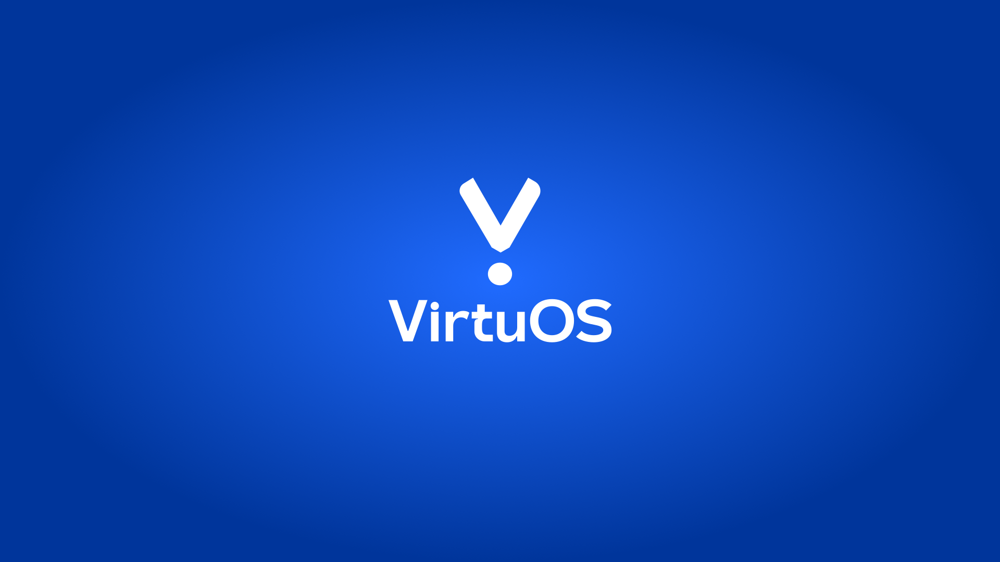

# VirtuOS


VirtuOS is a high-performance, web-based operating system built with Preact, TypeScript, and Vite. It features a robust Virtual File System (VFS), window management, and a suite of built-in applications.

## 📺 Demo

Check out the features of VirtuOS in action:

<video width="100%" controls>
  <source src="public/demo.mp4" type="video/mp4">
  Your browser does not support the video tag.
</video>

---

## 🚀 Key Features

### 🖥️ Desktop Environment
- **Multi-Window Interface**: Overlapping windows with focus management, minimize, maximize, and resize capabilities.
- **Taskbar & Start Menu**: Quick access to running processes and application registry.
- **Context Menus**: Right-click functionality integrated across the desktop and file manager.
- **Notification System**: Real-time system and application alerts.

### 📁 Virtual File System (VFS)
VirtuOS implements a persistent VFS using `IndexedDB` (via `idb-keyval`).
- **Persistence**: Files and directories survive page reloads.
- **Standard Linux Hierarchy**: Includes `/home`, `/bin`, `/trash`, etc.
- **Operations**: Support for `mkdir`, `writeFile`, `copyFile`, `moveFile`, and recursive directory operations.

### 🛠️ Core Applications
VirtuOS comes with a variety of pre-installed applications:
- **Terminal**: A CLI environment for interacting with the VFS.
- **Files**: A graphical file explorer with marquee selection and drag-and-drop support.
- **Browser**: Built-in web browsing capabilities.
- **Notepad**: Text editing with VFS integration.
- **Settings**: System customization (Themes, Wallpapers).
- **Task Manager**: Monitor and manage active processes.
- **Media Player & Photos**: View images and play videos from the VFS.
- **App Store**: A portal for discovering new system features.

---

## 🏗️ Technical Architecture

### **The Kernel (`src/kernel`)**
The "Kernel" acts as the central state manager using **Zustand**. It handles:
- **Process Management**: Launching and terminating applications.
- **Window State**: Tracking position, z-index, and window states.
- **Authentication**: Managing user login and setup state.

### **The OS Hook (`useOS`)**
A custom hook that provides a clean API for applications to interact with the system:
```typescript
const { launchApp, notify, fs, windows } = useOS();
```

### **Application Registry (`src/apps/registry.ts`)**
Applications are lazy-loaded to optimize initial boot time. Adding a new app involves registering its metadata and entry component.

---

## 🛠️ Development

### Prerequisites
- Node.js (v22+)
- npm

### Setup
1. Clone the repository
2. Install dependencies:
   ```bash
   npm install
   ```
3. Start the development server:
   ```bash
   npm run dev
   ```

### Building for Production
```bash
npm run build
```

---

## 🎨 Visual Identity

| Theme Palette | Sample Wallpaper |
| :---: | :---: |
|  |  |

---

## 📄 License
MIT

---
*Built with ❤️ by the VirtuOS Team.*
